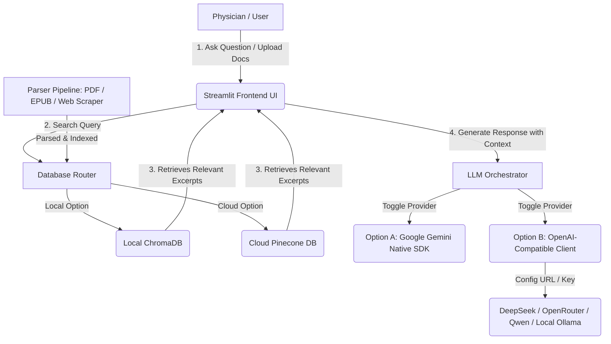

# Medical Subspecialty Consulting Agent

This implementation plan outlines the architecture and step-by-step guide to build a sensitive medical information consulting agent for physicians. The system is designed to ground its answers strictly in trustworthy literature provided manually (e.g., PDFs, EPUBs, text files) or crawled from specific trusted websites, minimizing hallucinations.

To serve as an impressive addition to a software engineering portfolio, this blueprint is structured to be **modular**, allowing physicians to dynamically upload/index files or URLs, and supports:
1.  **Pluggable LLM Backends**: Google Gemini API vs. any OpenAI-Compatible API (OpenRouter, DeepSeek, Qwen, local Ollama).
2.  **Pluggable Vector Databases**: Local ChromaDB (for zero-setup testing) vs. **Cloud Pinecone** (for a growing, persistent index accessible from any machine).

---

## Architecture Blueprint



### 1. Vector Database Options: ChromaDB vs. Pinecone Cloud
The vector database layer will be abstracted using a standard Interface class so the application can toggle between databases using a single `.env` setting:

*   **ChromaDB (Local)**:
    *   *Usage*: Perfect for local development and offline runs.
    *   *Data Sync*: Saved as local files in `data/vector_db/`. Cannot be synced natively between machines.
*   **Pinecone (Cloud Free Tier)**:
    *   *Usage*: Recommended for production/clinical deployment.
    *   *Data Sync*: **100% online**. All text chunks and embeddings are stored in Pinecone's cloud. 
    *   *Benefits*: As the physician adds cases and articles, the database grows securely online. If the app is run from a laptop, office PC, or tablet, it accesses the exact same, up-to-date index immediately.
    *   *Cost*: **Free** (Pinecone's free tier supports up to 100,000 vector embeddings, which is equivalent to ~50-100 full books).

---

### 2. Flexible LLM Client Interface
The LLM layer is designed to run either natively on Gemini or via any OpenAI-compatible API key/endpoint (OpenRouter, DeepSeek, etc.).

---

## Step-by-Step Implementation Roadmap

### Phase 1: Environment & Project Structure Setup
1. Define the directory hierarchy:
   ```
   med-consultant-agent/
   ├── app.py                # Streamlit UI (chat interface + admin ingest panel)
   ├── config.py             # Parses environment variables
   ├── core/
   │   ├── __init__.py
   │   ├── db.py             # VectorDB interface (abstracts Chroma vs. Pinecone)
   │   ├── ingestor.py       # Extract text from PDF/EPUB/HTML & chunk
   │   ├── retriever.py      # Search VectorDB for relevant text blocks
   │   └── generator.py      # Abstracted interface supporting Gemini SDK or OpenAI-style client
   ├── data/                 # Directory for local DB storage (gitignored)
   ├── requirements.txt      # Project dependencies
   └── .env.example          # Sample environment configurations
   ```
2. Configure `.env` structure:
   ```env
   # LLM Provider Configuration
   LLM_PROVIDER=gemini       # or openai_compatible
   GEMINI_API_KEY=your_gemini_key
   
   # OpenAI-Compatible details (Optional: DeepSeek, OpenRouter, Ollama)
   OPENAI_API_BASE=https://api.deepseek.com/v1
   OPENAI_API_KEY=your_deepseek_key
   OPENAI_MODEL_NAME=deepseek-chat
   
   # Vector Database Configuration
   VECTOR_DB_TYPE=pinecone   # chroma or pinecone
   PINECONE_API_KEY=your_pinecone_key
   PINECONE_ENVIRONMENT=us-east-1
   PINECONE_INDEX_NAME=med-consultant
   ```

### Phase 2: Modular Ingestion & DB Interface
1. Build `core/db.py` to define the vector storage interface. Implement concrete classes for `ChromaStore` and `PineconeStore`.
2. Write parsers in `core/ingestor.py` for PDFs (via `pypdf`), EPUBs (via `beautifulsoup4` or `ebooklib`), and URLs (scraped via `requests` and sanitized).

### Phase 3: Retriever & LLM Interface
1. Set up search routing to retrieve the top $K$ context chunks from the active database.
2. Build the LLM generator in `core/generator.py` to format the prompt guidelines ensuring strict evidence-based grounding.

### Phase 4: Dynamic Streamlit UI
1. Chat dashboard with collapsible citations detailing the source and page.
2. Admin Sidebar allowing:
   - Dynamic upload of PDFs/EPUBs.
   - Text inputs for trusted URLs to scrape and index.
   - Status indicators showing successful database synchronization.

### Phase 5: Verification & Portfolio Polishing
1. Create a script to run test assertions on context search and citation retrieval.
2. Complete a comprehensive `README.md` showing how a new user can get started with either Chroma (local) or Pinecone (cloud).
